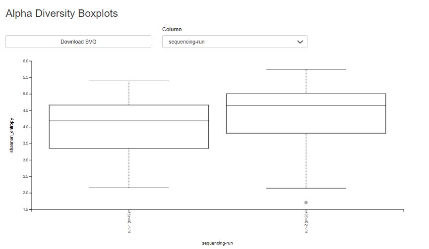

### Fecal Microbiota Transplant Bioinformatics Analysis

## Author
Kyara Crespo Gutierrez

## Background
## Methods
## Findings
# Taxonomic Composition

At the phylum level, a few dominant groups account for most relative abundance, but microbial composition was still varied across samples.

# Alpha Diversity (Shannon Index)

Shannon diversity varied across samples, indicating differences in within-sample microbial diversity.

# Bray-Curtis PCoA

PCoA analysis showed separation between samples, indicating differences in microbial community composition.
