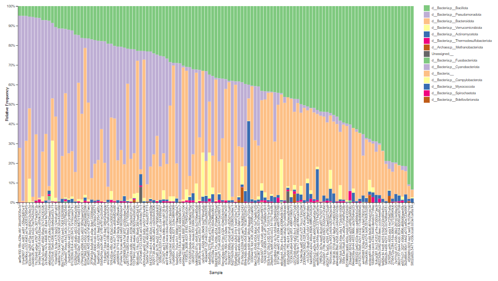
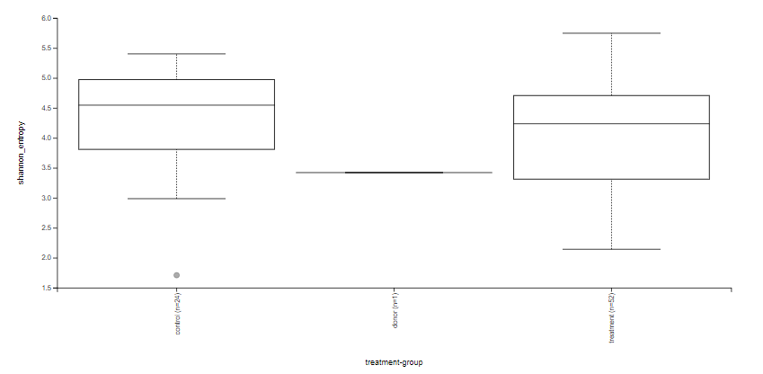
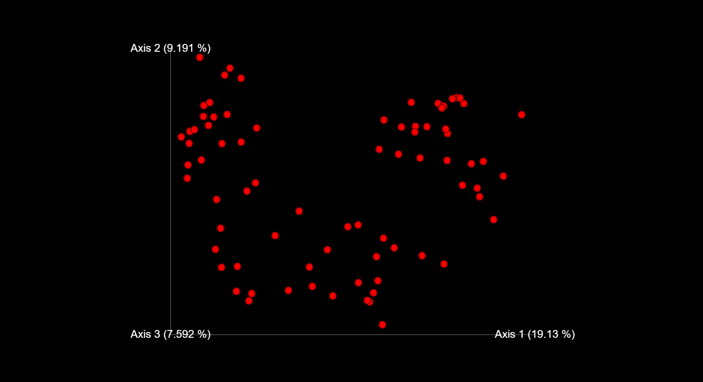

# Fecal Microbiota Transplant Bioinformatics Analysis

## Author
Kyara Crespo Gutierrez

## Background
## Methods
## Findings
### Taxonomic Composition

Figure 1. Taxa barplot at phylum level created using QIIME2 taxa barplot program with data taken from table.qza and taxonomy.qza files. At the phylum level, a few dominant groups account for most relative abundance, but microbial composition was still varied across samples.

### Alpha Diversity (Shannon Index)

Figure 2. Alpha diversity (Shannon index) created using QIIME2 diversity and alpha-group-significance programs with data taken from table.qza file. Shannon diversity varied across samples, indicating differences in within-sample microbial diversity.

### Bray-Curtis PCoA

Figure 3. Bray-Curtis PCoA created using QIIME2 diversity and Emperor programs with data taken from table.qza file. PCoA analysis showed separation between samples, indicating differences in microbial community composition.
