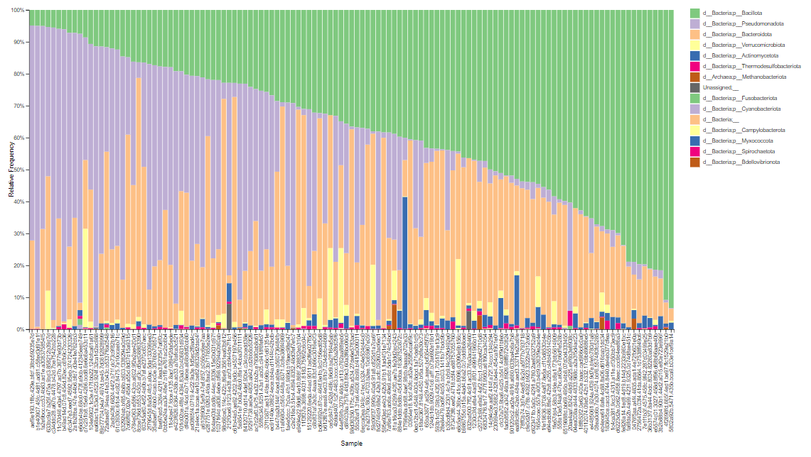
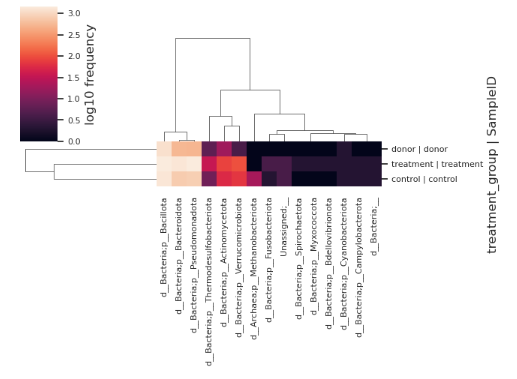
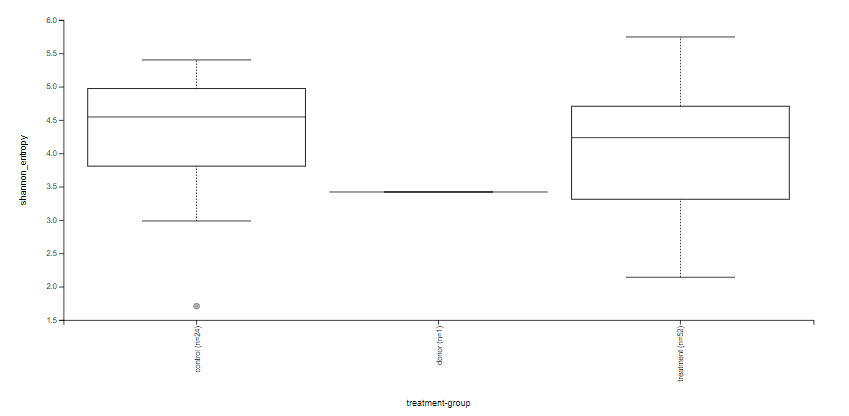
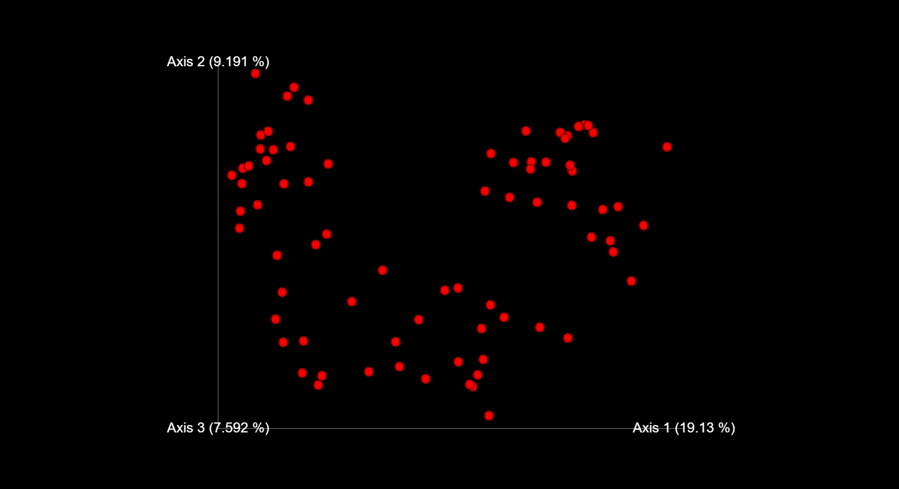

# Fecal Microbiota Transplant Bioinformatics Analysis

## Author
Kyara Crespo Gutierrez and Max the dino because saying "we" sounds better than "I".

## Background
In 2017, Kang et. al. published a study on fecal matter transplants done on children diagnosed with Austism Spectrum Disorder (ASD) who also presented with gastrointestinal (GI) problems. The goal of the transplants was to alleviate GI symptoms under the hypothesis that these symptoms stemmed from harmful gut microbiota. By ridding the children of their original gut microbiome and substituting it with healthy bacteria from fecal donations from healthy individuals, the researchers found that microbiota transfer therapy alters gut ecosystems and can not only improve GI symptoms, but also improve behavioral ASD symptoms for up to eight weeks after treatment. As part of the study, Kang et. al. extracted DNA from feces, swabs, and donor samples to later sequence the microbiota of participants using the barcoded primer set 515f-806r. 

For this final project, we decided to utilize the sequencing data from the 2017 Kang et. al fecal matter transplant study, analyzing the abundance and dirstribution of different bacteria phyla present in the human gut.

## Methods
The following pipeline was loaded with a conda environment on the University of New Hampshire’s RON computing cluster.

Sequencing data was obtained from https://docs.qiime2.org/2024.10/tutorials/fmt/. The files downloaded were in qza and tsv formats and needed to be examined and trimmed. To examine the reads, we used QIIME’s demultiplexing summary program (demux summarize), and to trim reads and remove low-quality regions, we used QIIME's DADA2 denoising program (dada2 denoise-single). The programs generated feature tables, representative sequences, denoising statistics, and base-transition statistics for each run. These programs were used twice given we downloaded two separate files, but once the reads from both files were cleaned up, we combined the datasets using QIIME’s feature table merge program (feature-table merge) and QIIME's sequence merge program (feature-table merge-seqs). Lastly, we created a summarized feature table using QIIME’s summary feature table program (feature-table summarize). 

To analyze the data and assign taxonomy, we used a SILVA 138 99% OUT classifier for the V4/V5 (515F/806R) region along with QIIME’s classifier program (feature-classifier classify-sklearn). We used QIIME’s taxa barplot program (taxa barplot) to visualize the abundance and distribution of taxa across different samples. Next, we built phylogenetic trees using QIIME’s phylogetic tree and alignment programs (phylogeny align-to-tree-mafft-fasttree) and analyzed their diversity metrics using QIIME’s diversity core metrics program (diversity core-metrics-phylogenetic). Lastly, the core diversity metrics were used to generate alpha and beta diversity plots using QIIME’s alpha group significance program and Emperor PCoA from Bray-Curtis program, respectively.

## Findings

QIIME2 was used to analyze sequencing data from a fecal matter transfer study to analyze the microbial composition and diversity of the microbiota of autistic children with gastrointestinal issues. Taxonomic composition, alpha and beta diversity, and grouped phylum-level abundance patterns were examined.

According to Figure 1, samples were dominated by several major bacterial phyla, including Bacillota, Bacteroidota, and Pseudomonadota. Relative abundances varied between samples, indicating compositional differences across treatment groups. The heatmap in Figure 2 shows several  differences in phyla abundance between groups, thus suggesting microbial composition changed depending on treatment. Differences in alpha diversity between groups in Figure 3 suggest variation in microbial abundance and diversity across experimental conditions. Meanwhile, clustering patterns observed in the PcoA plot in Figure 4 suggest that microbial communities differed between treatment groups, although some overlap remained between samples.

Overall, the analyses provided measurable differences in microbiome composition and diversity across groups. Additionally, taxonomic composition and grouped phylum abundance patterns suggest microbial variation associated with treatment.

### Taxonomic Composition

Figure 1. Taxa barplot at phylum level created using QIIME2 taxa barplot program with data taken from table.qza and taxonomy.qza files. At the phylum level, a few dominant groups account for most relative abundance, but microbial composition was still varied across samples.

### Average Phylum Composition by Treatment Group

Figure 2. Heatmap created using QIIME2 heatmap program with data taken from grouped-phylum-table.qza and grouped-treatment-metadata.tsv files. Distinct abundance patterns across groups suggests treatment-associated differences in microbial composition.

### Alpha Diversity (Shannon Index)

Figure 3. Alpha diversity (Shannon index) created using QIIME2 diversity and alpha-group-significance programs with data taken from table.qza file. Shannon diversity varied across samples, indicating differences in within-sample microbial diversity.

### Bray-Curtis PCoA

Figure 4. Bray-Curtis PCoA created using QIIME2 diversity and Emperor programs with data taken from table.qza file. PCoA analysis showed separation between samples, indicating differences in microbial community composition.
